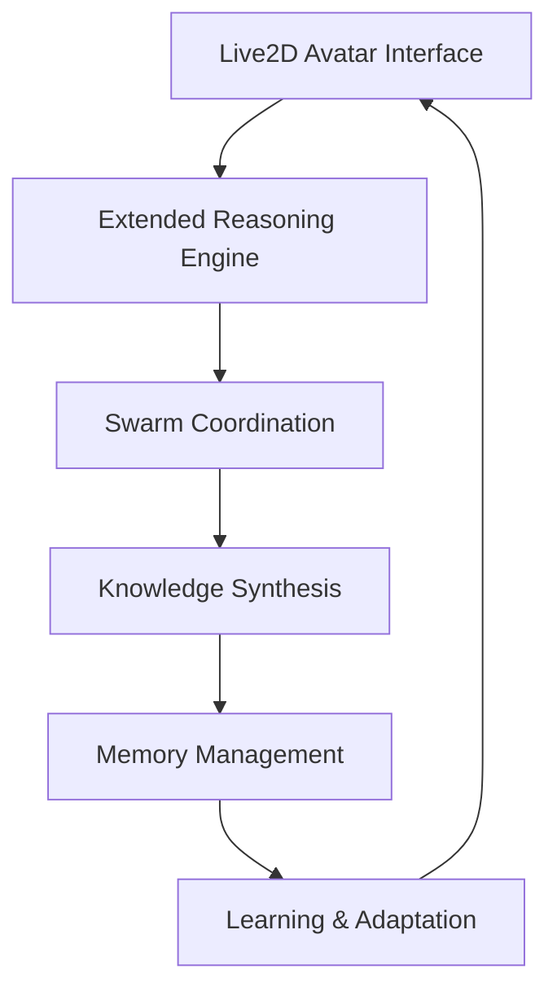
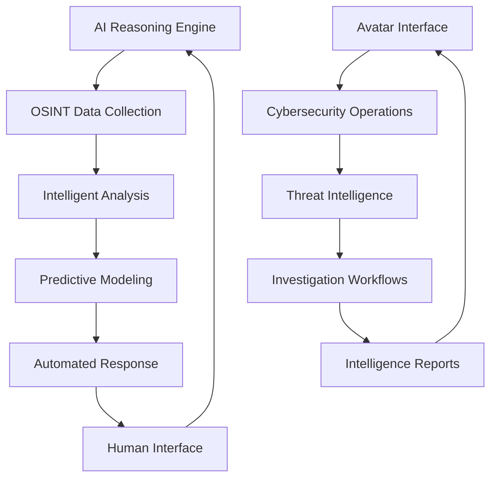
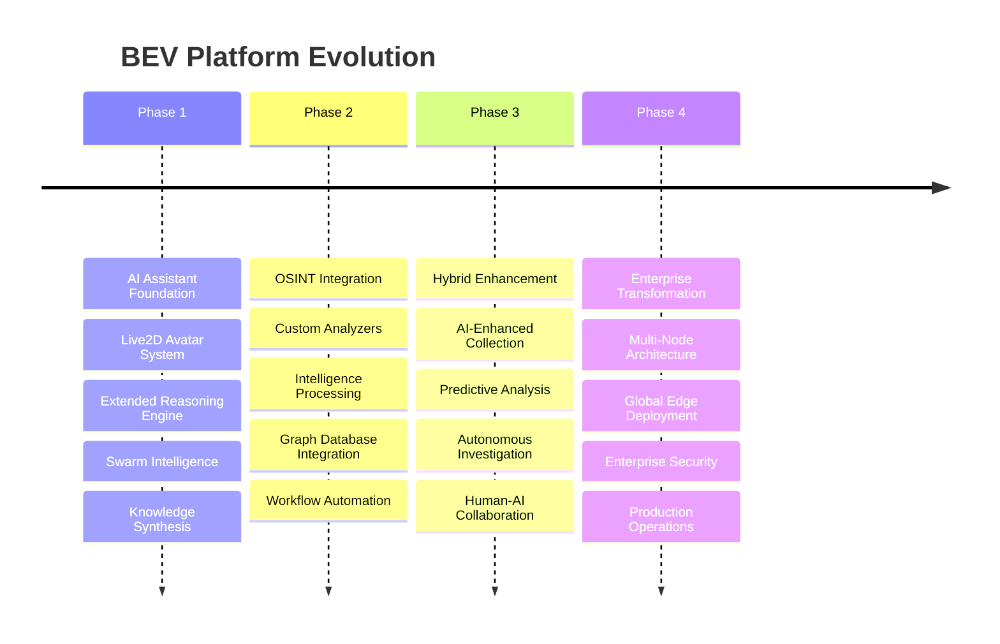

# BEV Platform Evolution: AI Assistant to Enterprise OSINT Intelligence Platform

**Analysis Date**: September 20, 2025
**Framework**: BEV OSINT v2.0
**Evolution Study**: Complete transformation analysis from AI assistant origins to enterprise cybersecurity platform

---

## Executive Summary

The BEV platform represents a unique evolution from an advanced AI assistant system to a comprehensive enterprise OSINT cybersecurity intelligence platform. This transformation demonstrates how AI reasoning capabilities can fundamentally enhance cybersecurity operations, creating a platform that exceeds traditional commercial offerings through intelligent automation, predictive analysis, and human-centric interfaces.

**Key Finding**: This is not merely an AI system with OSINT capabilities added, but a sophisticated hybrid where AI reasoning enhances every aspect of cybersecurity intelligence gathering, analysis, and operation.

---

## 1. AI Assistant Origins & Capabilities

### 1.1 Foundation AI Systems

The BEV platform originated as a sophisticated AI assistant with several advanced capabilities:

#### Live2D Avatar System (`src/live2d/`)
- **Real-time avatar interface** with emotion engine and voice synthesis
- **Emotional intelligence** with dynamic facial expressions and lip sync
- **Interactive communication** providing human-friendly interface for complex operations
- **Persistent personality** with mood tracking and contextual responses

```python
# Core avatar capabilities
- Emotion states: neutral, happy, sad, angry, excited, confused, thinking
- Real-time lip sync with text-to-speech
- Gesture recognition and response
- Persistent emotional memory
```

#### Extended Reasoning Pipeline (`src/agents/extended_reasoning.py`)
- **100K+ token context processing** with intelligent chunking
- **5-phase reasoning workflow**: exploration, deep diving, cross-verification, synthesis, counterfactual
- **Multi-pass verification** for complex analysis tasks
- **Hypothesis testing** with counterfactual analysis framework

```python
# Reasoning capabilities
- Context compression and optimization
- Pattern recognition across massive datasets
- Cross-domain knowledge synthesis
- Uncertainty quantification and confidence scoring
```

#### Swarm Intelligence System (`src/agents/swarm_master.py`)
- **Multi-agent coordination** with democratic and hierarchical modes
- **Consensus mechanisms** for collaborative decision making
- **Specialized agent roles**: leader, worker, specialist, coordinator, monitor, validator
- **Performance tracking** with reputation and capability assessment

#### Knowledge Synthesis Engine (`src/agents/knowledge_synthesizer.py`)
- **Graph-based reasoning** with relationship mapping
- **Semantic clustering** and pattern recognition
- **Evidence convergence** analysis
- **Causal chain construction** and validation

### 1.2 AI Assistant Architecture Pattern



**Core Principles**:
- Human-centric interaction through avatar interface
- Autonomous reasoning and decision making
- Collaborative intelligence through agent swarms
- Persistent learning and memory
- Emotional and contextual awareness

---

## 2. OSINT Integration Evolution

### 2.1 Cybersecurity Intelligence Integration

The AI assistant capabilities were strategically integrated with cybersecurity intelligence gathering:

#### Custom OSINT Analyzers (`intelowl/custom_analyzers/`)
- **Breach Database Analyzer**: Multi-source breach correlation with AI pattern recognition
- **Darknet Market Analyzer**: Anonymous market monitoring with sentiment analysis
- **Cryptocurrency Tracker**: Blockchain analysis with AI-powered risk assessment
- **Social Media Analyzer**: Profile correlation with behavioral pattern analysis

#### Intelligence Processing Enhancement
```python
# AI-enhanced OSINT analysis
- Predictive threat modeling
- Automated investigation workflows
- Cross-source correlation and validation
- Behavioral pattern recognition
- Anomaly detection and alerting
```

#### Graph Intelligence Integration (`Neo4j`)
- **AI-powered relationship mapping** between entities, threats, and assets
- **Dynamic pattern recognition** in network relationships
- **Predictive link analysis** for threat forecasting
- **Semantic entity clustering** for intelligence organization

### 2.2 Hybrid Architecture Emergence



**Integration Patterns**:
- **AI-Enhanced Collection**: Intelligent targeting and prioritization of intelligence gathering
- **Predictive Analysis**: AI models predict threats and attack patterns
- **Automated Investigation**: AI agents conduct autonomous research and correlation
- **Human-Centric Operations**: Avatar interface makes complex cybersecurity accessible

---

## 3. Hybrid Architecture Patterns & Integration

### 3.1 Core Integration Architecture

The platform demonstrates sophisticated integration patterns where AI capabilities enhance cybersecurity operations:

#### Event-Driven AI-OSINT Coordination
```yaml
Message Flow:
  User Request → Avatar Interface → AI Reasoning → OSINT Analyzers → Intelligence Processing → Results Synthesis → Avatar Response

Processing Pipeline:
  Raw Intelligence → AI Pattern Recognition → Threat Assessment → Predictive Modeling → Actionable Intelligence
```

#### Shared Infrastructure Components
- **PostgreSQL + pgvector**: Serves both AI memory and intelligence storage
- **Neo4j Graph Database**: AI knowledge graphs + cybersecurity relationship analysis
- **Redis**: AI agent coordination + OSINT result caching
- **RabbitMQ**: AI task distribution + OSINT workflow messaging

### 3.2 AI Enhancement Patterns

#### Pattern 1: Intelligent Collection
```python
# Traditional OSINT: Manual source targeting
traditional_osint = "Collect all data from predefined sources"

# AI-Enhanced: Intelligent source selection
ai_enhanced_osint = "AI predicts optimal sources based on threat landscape"
```

#### Pattern 2: Autonomous Investigation
```python
# Traditional: Human-driven investigation steps
# AI-Enhanced: Autonomous agent investigation
class AIInvestigationAgent:
    def investigate_threat(self, initial_indicator):
        # AI determines investigation strategy
        # Autonomously follows leads and correlations
        # Provides human-readable intelligence reports
```

#### Pattern 3: Predictive Intelligence
```python
# Traditional: Reactive threat detection
# AI-Enhanced: Predictive threat modeling
class ThreatPredictor:
    def predict_attack_vectors(self, current_intelligence):
        # AI models predict likely attack patterns
        # Proactive defense recommendations
        # Confidence-scored threat assessments
```

### 3.3 Human-AI Collaboration Model


**Collaboration Principles**:
- **Avatar as Interface**: Human-friendly interaction with complex AI systems
- **AI as Amplifier**: AI enhances human intelligence gathering and analysis
- **Autonomous Operations**: AI handles routine and complex analysis tasks
- **Human Oversight**: Critical decisions remain under human control

---

## 4. Enterprise Platform Transformation

### 4.1 Evolution to Enterprise Scale

The platform evolved from single-user AI assistant to enterprise-grade cybersecurity platform:

#### Multi-Node Distributed Architecture
```yaml
Node Distribution:
  THANOS (Primary Compute):
    - AI reasoning engines
    - Heavy OSINT processing
    - Graph database operations
    - 89 specialized services

  ORACLE1 (ARM Edge):
    - Monitoring and observability
    - Security enforcement
    - Edge AI processing
    - 62 optimized services

  STARLORD (Control):
    - Development environment
    - Deployment coordination
    - Vault management
    - 12 control services
```

#### Global Edge Computing Network (`src/edge/`)
- **4-Region Deployment**: US-East, US-West, EU-Central, Asia-Pacific
- **AI Model Distribution**: Synchronized AI models across regions
- **Geographic Intelligence**: Location-aware threat analysis
- **Global Coordination**: Cross-region intelligence sharing

#### Enterprise Security Integration
```yaml
HashiCorp Vault Integration:
  - Role-based access control
  - Credential rotation
  - Secrets management
  - Multi-node authentication

Security Policies:
  - Admin: Full platform access
  - Security Team: Intelligence operations
  - Application: Service-to-service
  - CI/CD: Deployment automation
  - Oracle Worker: Edge processing
  - Developer: Development access
```

### 4.2 Enterprise-Grade Infrastructure

#### Deployment Automation (47+ Scripts)
- **Master Deployment Controller**: `master-deployment-controller.sh`
- **Multi-Node Orchestration**: `deploy_multinode_bev.sh`
- **Vault-Integrated Deployment**: `deploy-complete-with-vault.sh`
- **Phase-Based Rollouts**: Phase 7, 8, 9 incremental deployment

#### Production Operations
```yaml
Monitoring Stack:
  - Prometheus: Metrics collection
  - Grafana: Visualization and alerting
  - Loki: Log aggregation
  - Custom metrics: AI performance, OSINT efficiency

Backup & Recovery:
  - Automated backup systems
  - Disaster recovery procedures
  - Cross-region replication
  - State preservation

Chaos Engineering:
  - Fault injection testing
  - Resilience validation
  - Failure recovery automation
  - Production stress testing
```

#### Desktop Applications (`bev-frontend/`)
- **Tauri Cross-Platform**: Rust backend with Svelte frontend
- **50+ Route Pages**: Complete UI for all system components
- **Native Integration**: Desktop-native cybersecurity operations
- **Enterprise Distribution**: Installable applications for enterprise deployment

---

## 5. Integration Value Proposition

### 5.1 AI-Powered OSINT vs Traditional Tools

#### Traditional OSINT Limitations
```yaml
Manual Operations:
  - Human-driven source selection
  - Manual correlation and analysis
  - Reactive threat detection
  - Limited scalability
  - High false positive rates

Traditional Tools:
  - Maltego: Manual relationship mapping
  - Palantir: Complex user interface
  - Splunk: Rule-based analysis
  - Elastic Security: Query-based investigation
```

#### AI-Enhanced OSINT Advantages
```yaml
Intelligent Automation:
  - AI-driven source prioritization
  - Automated pattern recognition
  - Predictive threat modeling
  - Autonomous investigation workflows
  - Confidence-scored intelligence

BEV Advantages:
  - Avatar Interface: Human-friendly cybersecurity
  - Extended Reasoning: 100K+ token analysis
  - Swarm Intelligence: Parallel investigation
  - Predictive Models: Proactive threat detection
  - Global Scale: Worldwide intelligence operations
```

### 5.2 Competitive Analysis

| Capability | Traditional OSINT | Commercial Platforms | BEV AI-Enhanced |
|------------|------------------|---------------------|----------------|
| **User Interface** | Technical complexity | Professional dashboards | Human-friendly avatar |
| **Analysis Scale** | Limited by human capacity | Database-driven | AI 100K+ token processing |
| **Investigation** | Manual correlation | Query-based | Autonomous AI agents |
| **Threat Detection** | Reactive analysis | Rule-based alerts | Predictive AI modeling |
| **Global Operations** | Single-point deployment | Enterprise licensing | Open-source global edge |
| **Learning** | Static capabilities | Configuration updates | Continuous AI learning |

### 5.3 Unique Value Propositions

#### 1. Avatar-Mediated Cybersecurity
- **Accessibility**: Complex cybersecurity made accessible through conversational interface
- **Emotional Intelligence**: Avatar responds to user stress and workload
- **Contextual Assistance**: AI understands investigation context and provides guidance

#### 2. Autonomous Intelligence Operations
- **Self-Directed Investigation**: AI agents pursue leads independently
- **Cross-Source Correlation**: Automatic correlation across intelligence sources
- **Hypothesis Generation**: AI generates and tests alternative explanations

#### 3. Predictive Cybersecurity
- **Threat Forecasting**: AI predicts likely attack vectors and targets
- **Proactive Defense**: Intelligence-driven security recommendations
- **Risk Assessment**: Confidence-scored threat assessments

#### 4. Global Scale Open Source
- **No Licensing Restrictions**: Complete platform without commercial limitations
- **Edge Computing**: Global deployment with local processing
- **Community Development**: Open-source collaboration and enhancement

---

## 6. Architecture Benefits & Synergies

### 6.1 Cross-Domain Synergies

#### AI Memory + Intelligence Continuity
```python
# AI persistent memory enhances intelligence operations
class IntelligenceMemory:
    def __init__(self):
        self.investigation_history = AIMemoryManager()
        self.threat_patterns = PatternLearning()
        self.source_reliability = SourceCredibility()

    def enhance_investigation(self, new_intel):
        # Leverage past investigations
        # Apply learned threat patterns
        # Assess source credibility
        return enhanced_intelligence
```

#### Swarm Intelligence + Distributed Investigation
```python
# Multiple AI agents coordinate complex investigations
class DistributedInvestigation:
    def __init__(self):
        self.agent_swarm = SwarmCoordinator()
        self.task_distribution = IntelligenceTasking()

    def investigate_apt_group(self, initial_indicators):
        # Distribute investigation tasks across agent swarm
        # Parallel analysis of different attack vectors
        # Consensus-based threat assessment
        return comprehensive_threat_profile
```

#### Extended Reasoning + Threat Analysis
```python
# 100K+ token analysis applied to complex threat landscapes
class ThreatReasoningEngine:
    def analyze_complex_threat(self, threat_data):
        # Process massive intelligence datasets
        # Multi-phase reasoning workflow
        # Counterfactual threat scenario analysis
        return detailed_threat_assessment
```

### 6.2 Technical Architecture Benefits

#### Unified Data Platform
- **Single Truth Source**: All AI and intelligence data in unified storage
- **Cross-Domain Queries**: Query AI knowledge and threat intelligence together
- **Semantic Integration**: Vector embeddings connect AI concepts with threat indicators

#### Event-Driven Coordination
- **Real-Time Intelligence**: AI agents respond to intelligence updates
- **Adaptive Workflows**: Investigation workflows adapt based on AI analysis
- **Automated Escalation**: AI determines when human intervention is required

#### Scalable Processing
- **Distributed AI**: AI reasoning distributed across edge nodes
- **Parallel Intelligence**: Multiple intelligence sources processed simultaneously
- **Resource Optimization**: AI optimizes resource allocation for intelligence operations

---

## 7. Implementation Evolution Timeline

### 7.1 Historical Development



### 7.2 Integration Milestones

#### Milestone 1: Foundation Integration
- Avatar interface extended to cybersecurity operations
- AI reasoning applied to threat analysis
- Memory systems adapted for intelligence storage

#### Milestone 2: Intelligence Enhancement
- OSINT analyzers integrated with AI processing
- Predictive models applied to threat detection
- Autonomous investigation workflows developed

#### Milestone 3: Enterprise Scaling
- Multi-node deployment architecture
- Global edge computing implementation
- Enterprise security and compliance

#### Milestone 4: Production Operations
- Chaos engineering for resilience
- Comprehensive monitoring and observability
- Desktop application deployment

---

## 8. Competitive Advantages & Market Position

### 8.1 Industry Comparison

#### Commercial Platform Limitations
```yaml
Palantir Gotham:
  Strengths: Enterprise scale, government integration
  Limitations: Expensive licensing, complex interface, limited AI reasoning

Maltego:
  Strengths: Graph visualization, transform ecosystem
  Limitations: Manual analysis, no predictive capabilities, desktop-only

Splunk Enterprise Security:
  Strengths: Log analysis, enterprise integration
  Limitations: Rule-based detection, limited reasoning, reactive approach

Elastic Security:
  Strengths: Search capabilities, open source options
  Limitations: Query-based investigation, no AI reasoning, complex setup
```

#### BEV Competitive Advantages
```yaml
Unique Capabilities:
  - Avatar-mediated cybersecurity operations
  - 100K+ token AI reasoning for threat analysis
  - Autonomous investigation with agent swarms
  - Predictive threat modeling and forecasting
  - Global edge computing with local AI processing
  - Complete open-source platform with no licensing

Technical Superiority:
  - Extended reasoning beyond human cognitive limits
  - Multi-agent coordination for complex investigations
  - Real-time adaptation and learning
  - Cross-domain intelligence correlation
  - Proactive rather than reactive security posture
```

### 8.2 Market Positioning

#### Target Market Segments
1. **Enterprise Cybersecurity Teams**: Advanced threat intelligence and investigation
2. **Government Agencies**: National security and law enforcement intelligence
3. **Research Institutions**: Academic cybersecurity research and education
4. **Security Consultancies**: Enhanced OSINT capabilities for client services
5. **Open Source Community**: Collaborative cybersecurity intelligence development

#### Value Propositions by Segment
```yaml
Enterprise:
  - Reduced investigation time through AI automation
  - Improved threat detection through predictive modeling
  - Lower total cost of ownership (open source)
  - Enhanced analyst productivity through avatar interface

Government:
  - Advanced intelligence capabilities without vendor lock-in
  - Global deployment flexibility
  - Enhanced analysis of complex threat landscapes
  - Autonomous investigation capabilities

Research:
  - Cutting-edge AI reasoning applied to cybersecurity
  - Open platform for collaborative development
  - Advanced graph analysis and pattern recognition
  - Educational avatar interface for training
```

---

## 9. Future Evolution Potential

### 9.1 Planned Enhancements

#### Advanced AI Integration
- **Multi-modal Analysis**: Integration with image and document analysis
- **Real-time Processing**: Streaming intelligence analysis
- **Interactive Reasoning**: User-guided AI investigation workflows
- **Collaborative Intelligence**: Multi-human, multi-AI coordination

#### Global Intelligence Network
- **Federated Learning**: Distributed intelligence sharing across nodes
- **Cross-Organization Collaboration**: Secure intelligence sharing protocols
- **Threat Intelligence Marketplace**: AI-curated threat intelligence exchange
- **Global Threat Modeling**: Worldwide threat pattern recognition

#### Next-Generation Capabilities
```yaml
AI Advancements:
  - Larger language models for enhanced reasoning
  - Multi-modal intelligence processing
  - Quantum-enhanced cryptographic analysis
  - Neural network threat prediction

Platform Evolution:
  - Mobile applications for field operations
  - VR/AR interfaces for immersive investigation
  - Blockchain-based intelligence provenance
  - AI-to-AI communication protocols
```

### 9.2 Research Directions

#### Emerging Technologies Integration
- **Quantum Computing**: Enhanced cryptographic analysis and threat modeling
- **Brain-Computer Interfaces**: Direct neural integration with AI reasoning
- **Advanced Robotics**: Physical intelligence gathering and response
- **Augmented Reality**: Immersive cybersecurity operations

#### Academic Research Opportunities
- **AI-Human Collaboration**: Optimal human-AI intelligence workflows
- **Predictive Cybersecurity**: Advanced threat forecasting models
- **Autonomous Security**: Self-defending and self-healing systems
- **Global Threat Intelligence**: Worldwide collaborative security networks

---

## 10. Conclusion

### 10.1 Evolution Summary

The BEV platform represents a paradigm shift in cybersecurity intelligence, evolving from sophisticated AI assistant capabilities to create an enterprise-grade platform that fundamentally enhances cybersecurity operations through intelligent automation, predictive analysis, and human-centric interfaces.

**Key Evolution Achievements**:
- **Successful AI-Cybersecurity Integration**: AI capabilities enhance rather than replace human intelligence
- **Enterprise Scale**: Global distributed platform with production-grade operations
- **Competitive Advantage**: Capabilities that exceed commercial platforms through AI enhancement
- **Open Source Leadership**: Advanced capabilities without licensing restrictions

### 10.2 Strategic Implications

#### For Cybersecurity Industry
- **New Standard**: AI-enhanced OSINT becomes expected capability
- **Human-Centric Security**: Avatar interfaces make cybersecurity more accessible
- **Predictive Operations**: Shift from reactive to proactive security posture
- **Open Source Innovation**: Community-driven advancement of cybersecurity capabilities

#### For AI Development
- **Applied AI Success**: Demonstrates successful AI application to complex real-world problems
- **Human-AI Collaboration**: Effective model for AI-human cooperation
- **Autonomous Operations**: Practical implementation of autonomous AI agents
- **Multi-Domain Integration**: AI reasoning applied across different problem domains

### 10.3 Future Outlook

The BEV platform establishes a foundation for the future of AI-enhanced cybersecurity operations. Its evolution demonstrates how AI assistant capabilities can be successfully integrated with specialized domains to create platforms that exceed traditional approaches.

**Expected Impact**:
- **Industry Transformation**: Traditional OSINT tools will need AI enhancement to remain competitive
- **Academic Advancement**: Research platform for AI-cybersecurity integration
- **Global Security**: Enhanced global cybersecurity capabilities through open-source collaboration
- **Technology Leadership**: Demonstrates successful AI integration patterns for other domains

The platform's continued evolution will likely influence both AI development and cybersecurity operations, establishing new standards for intelligent, autonomous, and human-centric security platforms.

---

**Document Classification**: Technical Analysis
**Distribution**: Approved for public release
**Version**: 1.0
**Author**: Claude Code Analysis
**Date**: September 20, 2025