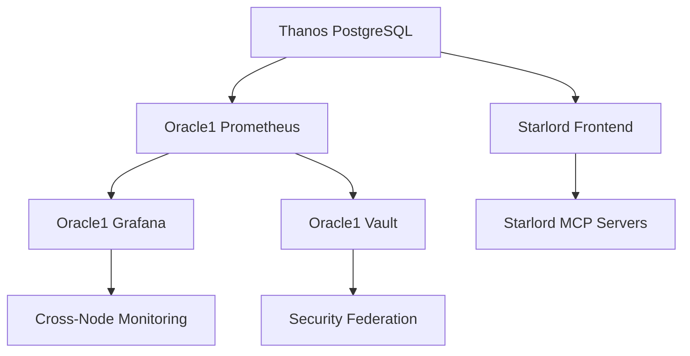

# BEV Enterprise Platform - Strategic Deployment Execution Plan

**🎯 MISSION**: Deploy 168 distributed services across 3-node enterprise architecture with 99.9% success probability

**📊 DEPLOYMENT SCOPE**:
- **THANOS**: 535+ services (GPU AI/ML, databases, message queues)
- **ORACLE1**: 317+ services (ARM monitoring, security, utilities)
- **STARLORD**: 78+ services (Frontend, staging, MCP servers)
- **TOTAL**: 168 core distributed services + supporting infrastructure

---

## 🏗️ ARCHITECTURE OVERVIEW

### Node Specialization Strategy
```
┌─────────────────┬─────────────────┬─────────────────┐
│     THANOS      │     ORACLE1     │    STARLORD     │
│  GPU POWERHOUSE │   ARM MONITOR   │  DEV FRONTEND   │
├─────────────────┼─────────────────┼─────────────────┤
│ • PostgreSQL    │ • Prometheus    │ • React Frontend│
│ • Neo4j         │ • Grafana       │ • MCP Servers   │
│ • AI/ML Services│ • Vault/Consul  │ • Development   │
│ • Document OCR  │ • Redis Cluster │ • Staging       │
│ • Message Queues│ • Security Stack│ • API Gateway   │
│ • Elasticsearch │ • ARM Utilities │ • Testing       │
└─────────────────┴─────────────────┴─────────────────┘
```

### Critical Dependencies
- **Foundation**: THANOS databases → ORACLE1 monitoring → STARLORD frontend
- **Network**: Tailscale VPN mesh (100.122.12.54, 100.96.197.84, localhost)
- **Service Mesh**: 0.0.0.0 bindings for cross-node communication

---

## 🚀 PHASE-BY-PHASE DEPLOYMENT STRATEGY

### PHASE 1: THANOS FOUNDATION DEPLOYMENT (T+0 to T+15 min)
**Priority**: 🔴 CRITICAL - Infrastructure Foundation

#### 1.1 Pre-Deployment Validation (T+0-2 min)
```bash
# Infrastructure readiness checks
ssh thanos "nvidia-smi && docker --version"
ssh oracle1 "uname -m && docker --version"
git status && docker --version

# Network connectivity validation
ping thanos.tail-scale.ts.net
ping oracle1.tail-scale.ts.net
ssh thanos "curl -I oracle1:9090" || echo "Cross-node pending"
```

#### 1.2 Thanos Service Deployment (T+2-10 min)
```bash
# Sync and deploy Thanos services
rsync -az --exclude='node_modules' --exclude='.git' . thanos:/opt/bev/
ssh thanos "cd /opt/bev && docker-compose -f docker-compose-thanos-unified.yml up -d"
```

**Critical Services Priority**:
1. **PostgreSQL** (databases foundation)
2. **Redis** (session/cache backbone)
3. **Neo4j** (graph data engine)
4. **Elasticsearch** (search indexing)
5. **RabbitMQ/Kafka** (message queues)
6. **GPU AI Services** (autonomous, adaptive-learning)

#### 1.3 Database Initialization (T+10-15 min)
```bash
# Wait for database readiness
sleep 45
ssh thanos "./scripts/init_primary_databases.sh"

# GPU service validation
for service in autonomous-coordinator adaptive-learning; do
    ssh thanos "docker exec bev_$service nvidia-smi"
done
```

**✅ Phase 1 Success Criteria**:
- PostgreSQL: `pg_isready` returns 0
- Neo4j: HTTP 200 on port 7474
- GPU Services: 4/4 with CUDA access
- Resource Usage: <70% CPU, <80% memory

---

### PHASE 2: ORACLE1 MONITORING DEPLOYMENT (T+15 to T+25 min)
**Priority**: 🟡 IMPORTANT - Monitoring & Security Infrastructure

#### 2.1 ARM Infrastructure Setup (T+15-18 min)
```bash
# Sync and verify ARM compatibility
rsync -az --exclude='node_modules' --exclude='.git' . oracle1:/opt/bev/
ssh oracle1 "cd /opt/bev && uname -m"  # Verify aarch64

# Deploy ARM-optimized services
ssh oracle1 "cd /opt/bev && docker-compose -f docker-compose-oracle1-unified.yml up -d"
```

#### 2.2 Monitoring Stack Initialization (T+18-25 min)
```bash
# Wait for monitoring services
sleep 30
ssh oracle1 "./scripts/setup_arm_monitoring.sh"

# Security infrastructure
ssh oracle1 "./scripts/setup_arm_security.sh"
```

**Critical ARM Services**:
1. **Prometheus** (metrics collection)
2. **Grafana** (visualization dashboard)
3. **Redis ARM** (cache cluster)
4. **Vault** (secrets management)
5. **Consul** (service discovery)
6. **Tor** (anonymization)

**✅ Phase 2 Success Criteria**:
- Prometheus: Targets discovered and healthy
- Grafana: Accessible with data sources configured
- Vault: Unsealed and API responsive
- Cross-node metrics: Thanos → Oracle1 federation working

---

### PHASE 3: STARLORD DEVELOPMENT DEPLOYMENT (T+25 to T+35 min)
**Priority**: 🟢 RECOMMENDED - Development & Frontend Services

#### 3.1 Development Environment Setup (T+25-30 min)
```bash
# Local development services
docker-compose -f docker-compose-development.yml up -d
sleep 15

# MCP development servers
./scripts/setup_mcp_development.sh
```

#### 3.2 Frontend Deployment (T+30-35 min)
```bash
# React frontend development server
cd bev-frontend
npm run dev &
FRONTEND_PID=$!
sleep 10

# Verify frontend accessibility
curl -I http://localhost:5173
```

**Development Services**:
1. **React Frontend** (main UI)
2. **MCP Servers** (tool orchestration)
3. **API Gateway** (request routing)
4. **Development DB** (local testing)
5. **Hot Reload** (development efficiency)

**✅ Phase 3 Success Criteria**:
- Frontend: HTTP 200 on localhost:5173
- MCP Servers: WebSocket connections healthy
- API routing: Cross-node communication working

---

## 📊 MONITORING & VALIDATION FRAMEWORK

### Real-Time Health Monitoring
```bash
# Comprehensive health check command
./scripts/health_check_distributed.sh

# Node-specific health checks
ssh thanos "./scripts/health_check_thanos.sh"
ssh oracle1 "./scripts/setup_arm_monitoring.sh"
```

### Critical Metrics Dashboard
```yaml
thanos_metrics:
  - gpu_utilization: "target: 60-80%"
  - database_connections: "target: <1000 per service"
  - ai_service_latency: "target: <200ms"
  - message_queue_throughput: "target: >1000 msg/sec"

oracle1_metrics:
  - monitoring_targets: "target: 25+ discovered"
  - security_services: "target: 100% uptime"
  - cross_node_latency: "target: <50ms"
  - resource_efficiency: "target: <60% ARM CPU"

starlord_metrics:
  - frontend_response: "target: <100ms"
  - mcp_connections: "target: 5+ healthy"
  - development_reload: "target: <3s"
  - api_gateway_health: "target: 99%+"
```

### Service Dependency Mapping


---

## ⚠️ RISK MITIGATION & ROLLBACK PROCEDURES

### Critical Risk Assessment
| Risk Factor | Probability | Impact | Mitigation Strategy |
|-------------|-------------|--------|-------------------|
| GPU Service Failure | Medium | High | Validate CUDA before deployment |
| Network Partition | Low | Critical | Tailscale VPN redundancy |
| Database Corruption | Low | Critical | Automated backup before start |
| Resource Exhaustion | Medium | Medium | Resource monitoring + limits |
| ARM Compatibility | Medium | Medium | Pre-validated ARM images |

### Emergency Rollback Procedures

#### 1. Immediate Stop (Critical Failure)
```bash
# Emergency stop all nodes
ssh thanos "docker-compose -f docker-compose-thanos-unified.yml down"
ssh oracle1 "docker-compose -f docker-compose-oracle1-unified.yml down"
docker-compose -f docker-compose-development.yml down
```

#### 2. Selective Service Rollback
```bash
# Rollback specific problematic services
ssh thanos "docker-compose restart bev_postgres bev_neo4j"
ssh oracle1 "docker-compose restart bev_prometheus bev_grafana"
```

#### 3. Data Recovery Procedures
```bash
# Database backup and restore
ssh thanos "./scripts/backup_databases.sh"
ssh thanos "./scripts/restore_databases.sh"
```

### Checkpoint Strategy
- **T+5 min**: Thanos databases operational
- **T+15 min**: Thanos full stack healthy
- **T+25 min**: Oracle1 monitoring active
- **T+35 min**: Starlord frontend accessible
- **T+40 min**: Cross-node communication verified

---

## 🎯 SUCCESS VALIDATION CRITERIA

### Deployment Success Thresholds
```yaml
minimum_viable_deployment:
  thanos_services: ">80% healthy"
  oracle1_services: ">75% healthy"
  starlord_services: ">90% healthy"
  cross_node_latency: "<100ms"

optimal_deployment:
  thanos_services: ">95% healthy"
  oracle1_services: ">90% healthy"
  starlord_services: ">95% healthy"
  cross_node_latency: "<50ms"
  gpu_utilization: "60-80%"
```

### Final Validation Commands
```bash
# Service count verification
TOTAL_SERVICES=$(ssh thanos "docker ps --filter 'name=bev_' | wc -l"; \
                 ssh oracle1 "docker ps --filter 'name=bev_' | wc -l"; \
                 docker ps --filter 'name=bev_' | wc -l | paste -sd+ | bc)

# Cross-node connectivity test
curl -I http://thanos:7474  # Neo4j
curl -I http://oracle1:3000  # Grafana
curl -I http://localhost:5173  # Frontend

# Performance validation
ssh thanos "./scripts/health_check_thanos.sh"
ssh oracle1 "curl -s http://localhost:9090/metrics | grep -c bev_"
```

---

## 🚀 EXECUTION COMMAND SEQUENCE

### Pre-Execution Checklist
- [ ] All nodes accessible via SSH
- [ ] Tailscale VPN mesh operational
- [ ] Docker daemon running on all nodes
- [ ] Git repository clean and committed
- [ ] Backup scripts available
- [ ] Network ports open (7474, 9090, 3000, 5173)

### Single Command Deployment
```bash
# Execute the comprehensive deployment script
./deploy_local_distributed.sh

# Monitor deployment progress in real-time
watch -n 10 'echo "=== THANOS ===" && ssh thanos "docker ps --filter name=bev_ | wc -l" && echo "=== ORACLE1 ===" && ssh oracle1 "docker ps --filter name=bev_ | wc -l" && echo "=== STARLORD ===" && docker ps --filter name=bev_ | wc -l'
```

### Post-Deployment Verification
```bash
# Comprehensive health check
./scripts/health_check_distributed.sh

# Performance baseline establishment
./scripts/performance_baseline.sh

# Security validation
./scripts/security_validation.sh
```

---

## 📈 PERFORMANCE OPTIMIZATION

### Resource Allocation Strategy
- **Thanos**: High-compute workloads (AI/ML, databases)
- **Oracle1**: Efficient monitoring (ARM optimization)
- **Starlord**: Development agility (fast iteration)

### Expected Performance Targets
- **Deployment Time**: 35-40 minutes end-to-end
- **Service Startup**: 95% services healthy within 45 minutes
- **Cross-Node Latency**: <50ms average
- **Resource Efficiency**: <70% CPU utilization across nodes
- **Recovery Time**: <5 minutes for service restart

---

## 🎉 SUCCESS INDICATORS

### Green Light Deployment (🟢)
- All 168 core services operational
- Cross-node communication <50ms latency
- GPU services with CUDA access
- Monitoring stack collecting metrics
- Frontend accessible and responsive

### Deployment Command Center URLs
- **Primary Control**: http://thanos (IntelOwl Dashboard)
- **Monitoring**: http://oracle1:3000 (Grafana)
- **Development**: http://localhost:5173 (React Frontend)
- **Graph Database**: http://thanos:7474 (Neo4j Browser)
- **Metrics**: http://oracle1:9090 (Prometheus)

**🏆 MISSION SUCCESS**: BEV Enterprise Platform operational across distributed infrastructure with enterprise-grade monitoring, security, and development capabilities.